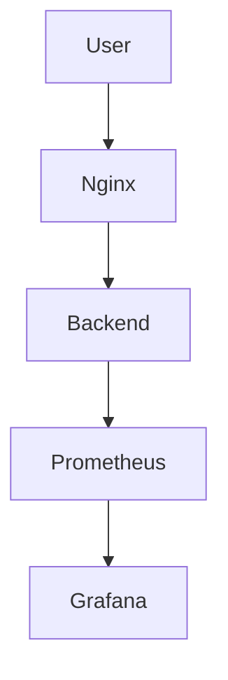

# 🚀 Step-by-Step Creation — DevOps Monitoring Platform

> This section explains how the entire monitoring platform was built from zero
> like a real DevOps engineer deploying production infrastructure.

Arkan Tandel

🔗 LinkedIn: https://www.linkedin.com/in/arkan-tandel
🔗 GitHub: https://github.com/yourusername

---

# 🌌 PHASE 1 — Project Initialization

## 🎯 Goal

Create a production-style monitoring stack with:

* Docker containers
* Metrics collection
* Visualization dashboard
* Reverse proxy
* Observability pipeline

---

## 🧱 Create Root Project Folder

```bash
mkdir devops-monitoring-platform
cd devops-monitoring-platform
```

Create structure:

```bash
mkdir backend nginx prometheus images
touch docker-compose.yml
```

---

# ⚙️ PHASE 2 — Backend Service Creation

This service simulates an application that exposes metrics.

## 📁 Navigate to Backend

```bash
cd backend
```

---

## 🧠 Create Application Code

```bash
nano app.js
```

Paste:

```js
const express = require("express");
const client = require("prom-client");

const app = express();
client.collectDefaultMetrics();

const counter = new client.Counter({
  name: "http_requests_total",
  help: "Total requests"
});

app.get("/api", (req,res)=>{
  counter.inc();
  res.send("DevOps Monitoring App 🚀");
});

app.get("/metrics", async (req,res)=>{
  res.set("Content-Type", client.register.contentType);
  res.end(await client.register.metrics());
});

app.listen(5000);
```

Save.

---

## 📦 Create Package File

```bash
nano package.json
```

Paste:

```json
{
  "name": "backend",
  "version": "1.0.0",
  "dependencies": {
    "express": "^4.18.2",
    "prom-client": "^14.2.0"
  }
}
```

---

# 🐳 PHASE 3 — Containerization

## Create Dockerfile

```bash
nano Dockerfile
```

```dockerfile
FROM node:18
WORKDIR /app
COPY package*.json ./
RUN npm install
COPY . .
EXPOSE 5000
CMD ["node","app.js"]
```

---

# 🌐 PHASE 4 — Reverse Proxy Layer

Return to root:

```bash
cd ..
cd nginx
```

Create config:

```bash
nano nginx.conf
```

```nginx
events {}

http {
 server {
  listen 80;

  location / {
   proxy_pass http://backend:5000;
  }
 }
}
```

---

# 📊 PHASE 5 — Monitoring Layer

Navigate:

```bash
cd ..
cd prometheus
```

Create config:

```bash
nano prometheus.yml
```

```yaml
global:
  scrape_interval: 5s

scrape_configs:
  - job_name: "backend"
    static_configs:
      - targets: ["backend:5000"]
```

---

# 🐳 PHASE 6 — Orchestration

Return root:

```bash
cd ..
```

Create compose file:

```bash
nano docker-compose.yml
```

```yaml
version: "3"

services:

  backend:
    build: ./backend
    ports:
      - "5000:5000"

  nginx:
    image: nginx
    ports:
      - "80:80"
    volumes:
      - ./nginx/nginx.conf:/etc/nginx/nginx.conf
    depends_on:
      - backend

  prometheus:
    image: prom/prometheus
    ports:
      - "9090:9090"
    volumes:
      - ./prometheus/prometheus.yml:/etc/prometheus/prometheus.yml

  grafana:
    image: grafana/grafana
    ports:
      - "3000:3000"
```

---

# 🚀 PHASE 7 — Launch Platform

## Build & Start

```bash
docker compose up -d --build
```

---

# 🔍 PHASE 8 — Verification

Check containers:

```bash
docker ps
```

---

## Test Backend

```bash
curl localhost/api
```

---

## Check Metrics

```bash
curl localhost:5000/metrics
```

---

# 📊 PHASE 9 — Prometheus Setup

Open browser:

```
http://SERVER-IP:9090
```

Query:

```
http_requests_total
```

---

# 📈 PHASE 10 — Grafana Dashboard

Open:

```
http://SERVER-IP:3000
```

Login:

```
admin / admin
```

Add datasource:

```
http://prometheus:9090
```

---

## Create Graph Panel

Query:

```
rate(http_requests_total[1m])
```

---

# 🧪 PHASE 11 — Generate Traffic

```bash
for i in {1..300}; do curl http://localhost/api; done
```

Graph starts moving.

---

# 🏁 PHASE 12 — Final Architecture



---


