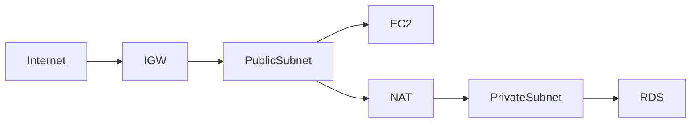
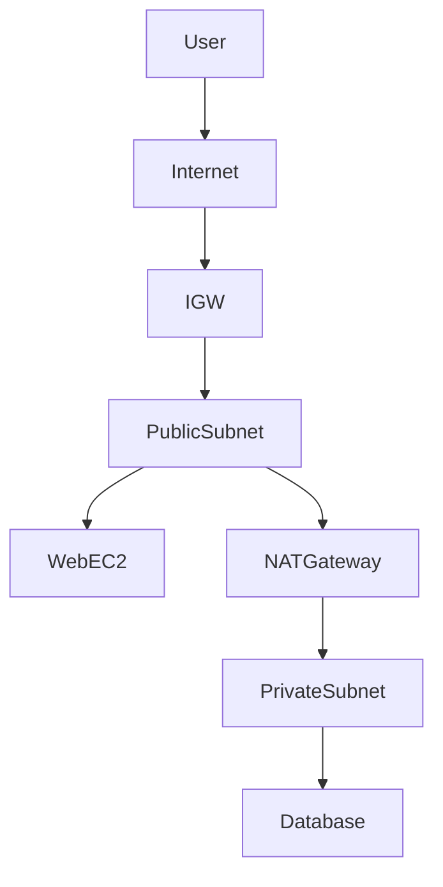
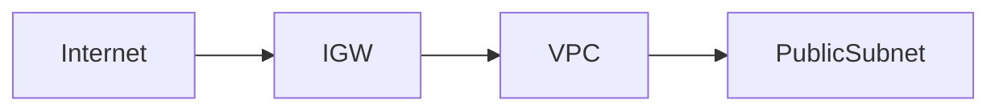
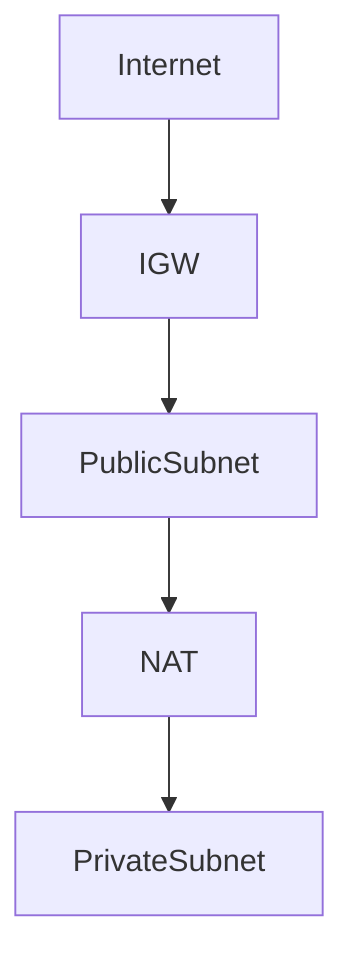
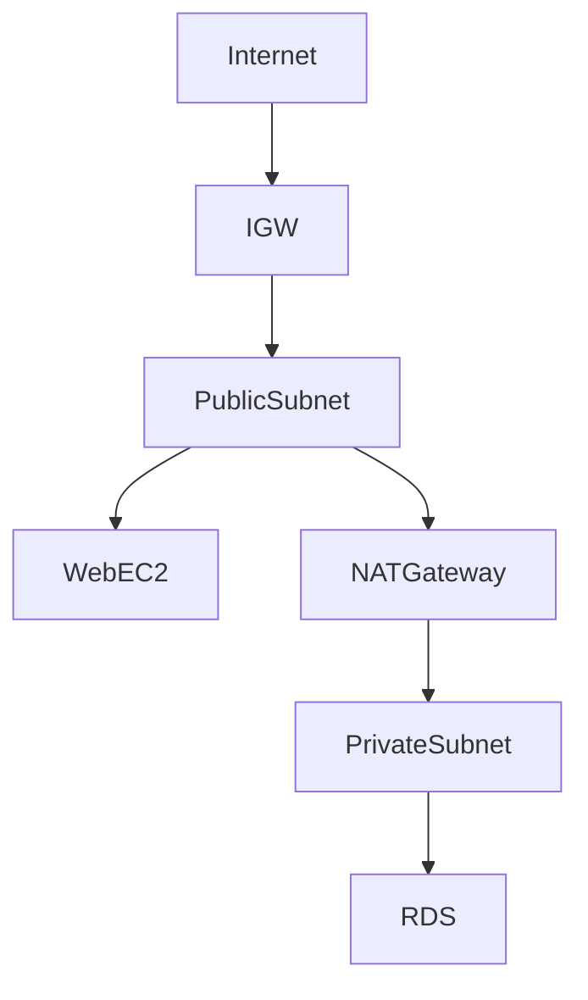
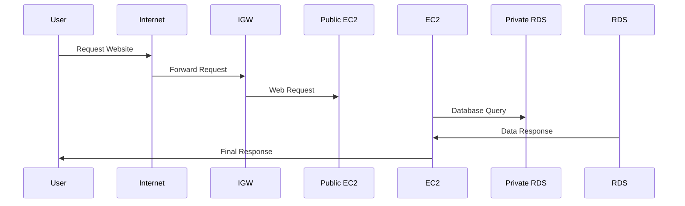

<!-- 🌩️ ULTRA CLOUD NETWORK BANNER -->

---

# 🌩️ AWS VPC Creation — Cloud Network Architecture Guide

<h3 align="center">Designing Secure, Scalable and Production-Ready Cloud Networks</h3>

---

---

# 🌟 Project Vision

A **Virtual Private Cloud (VPC)** allows you to create your own isolated network inside AWS Cloud — similar to running your own private data center but fully managed and scalable.

This guide demonstrates how real cloud engineers design production-ready network architectures.

---

# 🧠 What You Will Learn

✔ Cloud Network Design
✔ Subnet Segmentation Strategy
✔ Secure Internet Access Design
✔ Private Workload Protection
✔ Enterprise Network Architecture Thinking

---

# 🏗️ High Level Architecture

---

# 🌐 Complete Cloud Network Architecture

---

# 🗺️ Step 1 — Create VPC

### Configuration

**Name:** My-VPC
**CIDR:** 10.0.0.0/16

Purpose → Defines entire private network range.

---

# 🧩 Step 2 — Create Subnets

### Public Subnet

CIDR → 10.0.1.0/24
Use → Web Servers, Bastion Host

### Private Subnet

CIDR → 10.0.2.0/24
Use → Databases, Backend Services

---

# 🌉 Step 3 — Internet Gateway (IGW)

Purpose → Public Internet Access

---

# 🛣️ Step 4 — Route Tables

### Public Route Table

0.0.0.0/0 → IGW

### Private Route Table

0.0.0.0/0 → NAT Gateway

---

# ⚙️ Step 5 — NAT Gateway

Purpose → Secure Internet Access for Private Subnet

---

# 🔐 Step 6 — Security Layers

| Layer          | Protection              |
| -------------- | ----------------------- |
| Security Group | Instance Level Firewall |
| NACL           | Subnet Level Firewall   |

---

# 🧠 Final Enterprise Architecture

---

# 📊 Network Traffic Flow

---

# ✅ VPC Components Summary

| Component       | Purpose                   |
| --------------- | ------------------------- |
| VPC             | Main Network              |
| Public Subnet   | Internet Facing Resources |
| Private Subnet  | Internal Secure Resources |
| IGW             | Internet Access           |
| NAT Gateway     | Secure Outbound Access    |
| Route Tables    | Traffic Control           |
| Security Groups | Instance Firewall         |
| NACL            | Subnet Firewall           |

---

# 🚀 Real World Usage

✔ Web Applications
✔ Banking Systems
✔ SaaS Platforms
✔ Microservices Architecture
✔ Enterprise Cloud Infrastructure

---

# 🧠 Cloud Engineer Pro Tips

🔥 Always use Multi AZ Design
🔥 Keep Databases in Private Subnet
🔥 Use Bastion Host for SSH Access
🔥 Enable VPC Flow Logs
🔥 Use Private Endpoints for AWS Services

---

# 👨‍💻 Author

## Arkan Tandel

Cloud & DevOps Engineer 🚀

LinkedIn → https://www.linkedin.com/in/arkan-tandel
GitHub → https://github.com/arkantandel

---

# ❤️ Cloud Philosophy

> Secure Networks Build Reliable Cloud Systems.

---

<!-- FOOTER BANNER -->

